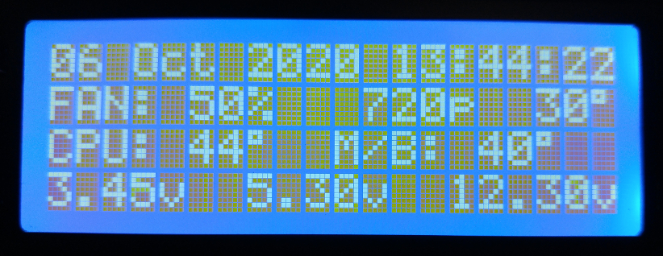
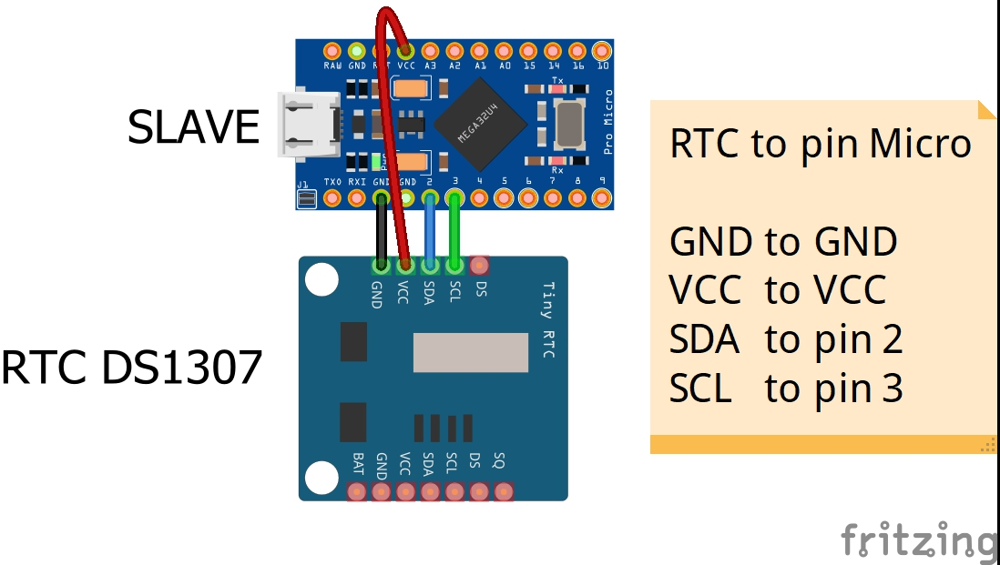
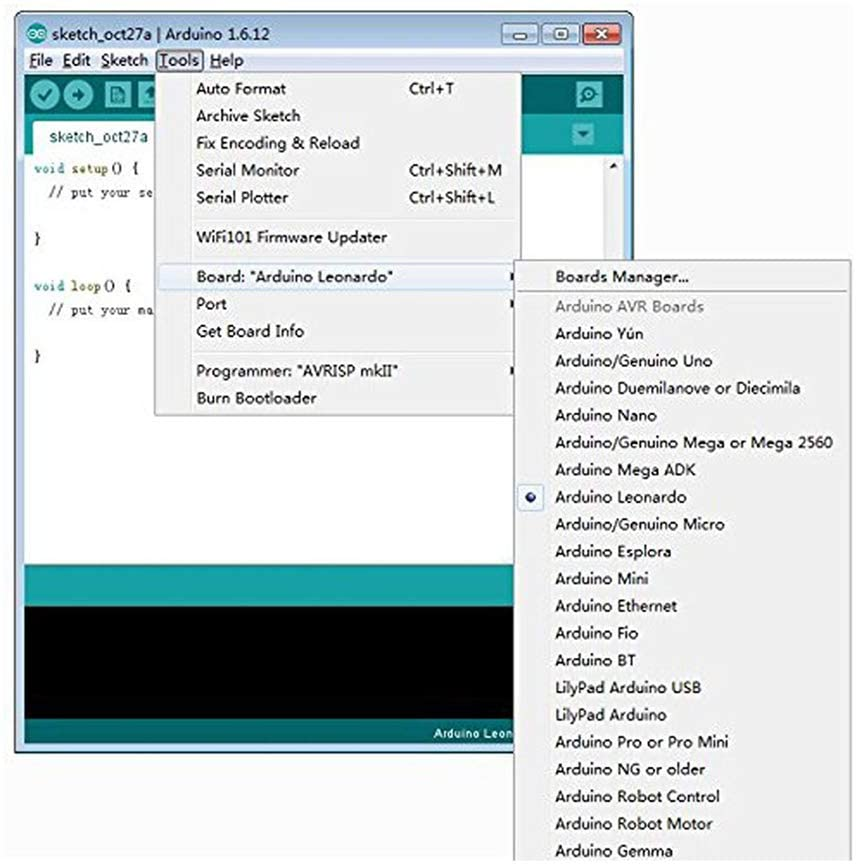
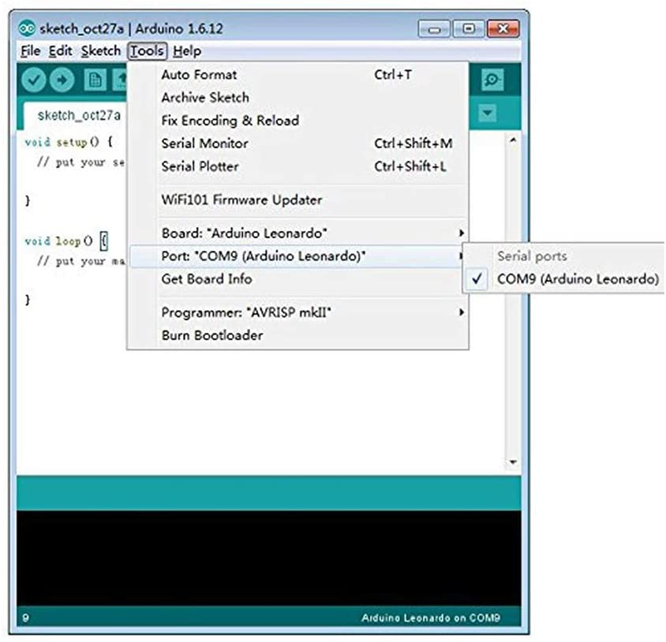
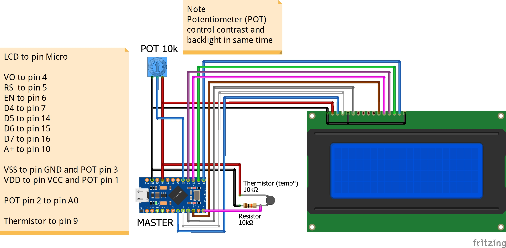
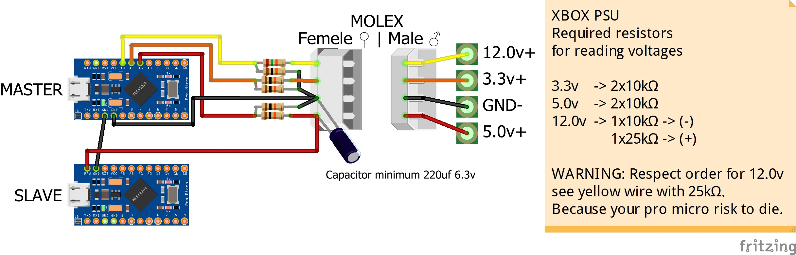
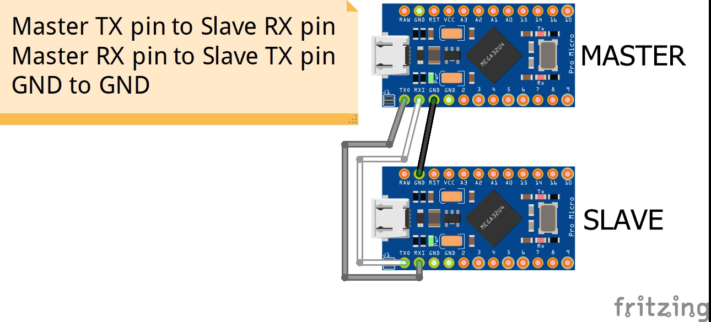
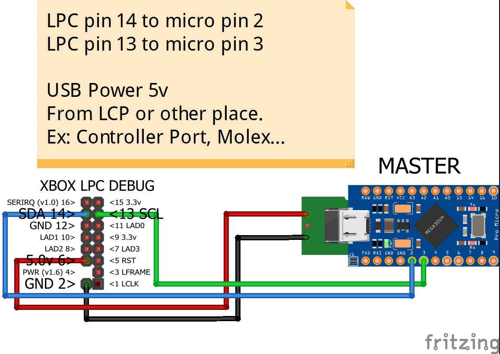
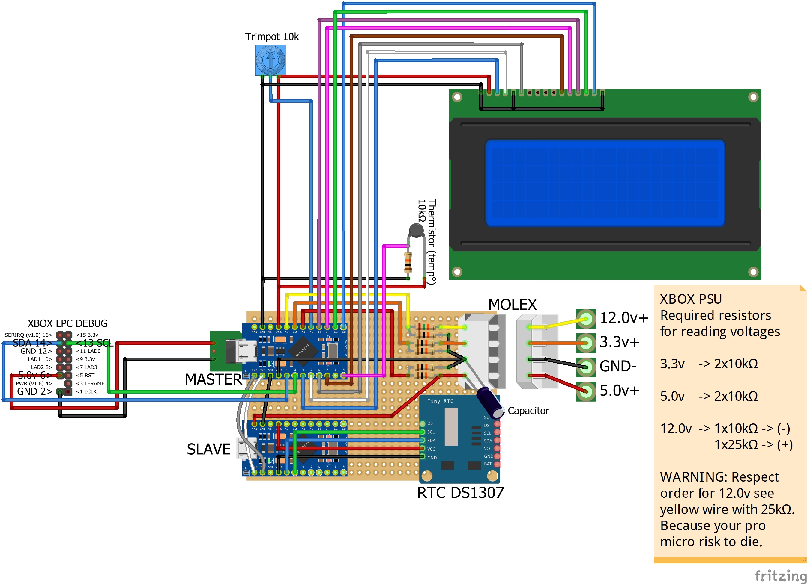

# RTC2Xbox
<p align="center">
  
</p>

<p align="center">
  <a href="LICENSE"></a>
  <a href="https://en.wikipedia.org/wiki/Prototype"></a>
  <a href="http://hits.dwyl.com/PatFrost/rtc2xbox"></a>
</p>
<p align="center">
  <a href="https://github.com/PatFrost/rtc2xbox/pulls"></a>
  <a href="https://github.com/PatFrost/rtc2xbox/issues"></a>
  <a href="https://github.com/PatFrost/rtc2xbox/issues"></a>
</p>

RTC2Xbox is inspired and based on [spi2par2019](https://github.com/Ryzee119/spi2par2019) by Ryzee119.
<br>It's a LCD mod for the original Xbox without modchip.

# New Features!
  - Display date and time with real time clock.
  - Display temperature ambient from a thermistor.
  - Display voltages 3.3v 5.0v 12.0v

**Note**
  - Delay for displaying fan speed, temp° of CPU, M/B and resolution is 2 secs to 30 secs for first time.
    <br>And the next times is 2 secs to 10 secs. It's depend of the SMBus if is busy or not.
  - Contrast and backlight are controlled by only one potentiometer in same time.

### Parts list
| Part | Qty | Shops | Optional |
| ---- | :----: | ----- | ----- |
| Arduino Pro Micro Leonardo **5V/16Mhz** | **2** | [Any clones will work.](https://www.amazon.com/s?k=Arduino+Pro+Micro+Leonardo+5V%2F16Mhz&ref=nb_sb_noss) Make sure they're the **5V/16Mhz** variant. |
| Adafruit **DS1307** Real Time Clock  | **1** | [Any clones will work.](https://www.amazon.com/Adafruit-3296-DS1307-Clock-Breakout/dp/B01MG3NEWF/ref=sr_1_1?dchild=1&keywords=RTC+DS1307&qid=1602338436&sr=8-1) I don't recommend chinese versions. 1 of 10 work correctly. |
| LCD 2004 | **1** | [Any LCD 20x4 will work.](https://www.amazon.com/s?k=LCD+2004&ref=nb_sb_noss) If IIC/I2C/TWI Serial Interface Adapter is present, remove it. |
| Resistor 10kΩ | **6** |[Any Resistor 10kΩ](https://www.amazon.com/BOJACK-Single-Resistor-Resistors-200pcs/dp/B07PGHP69F/ref=sr_1_8?dchild=1&keywords=Resistor+10k%E2%84%A6&qid=1602341361&sr=8-8) Or any resistor in series with total values 10kΩ |
| Resistor 25kΩ | **1** | [Any Resistor 25kΩ](https://www.amazon.com/s?k=Resistor+25k%E2%84%A6&ref=nb_sb_noss) Or any resistor in series with total values 25kΩ |
| Thermistor 10kΩ | **1** | [Any Thermistor 10kΩ](https://www.amazon.com/s?k=Thermistor+10k%E2%84%A6&s=price-asc-rank&qid=1602342606&ref=sr_st_price-asc-rank) | **Optional** |
| Potentiometer 10kΩ | **1** |[Any Potentiometer 10kΩ](https://www.amazon.com/s?k=Potentiometer+10k%E2%84%A6&ref=nb_sb_noss)|
| Capacitor 220uf | **1** | [Any Capacitor](https://www.amazon.com/s?k=Capacitor+220uf&ref=nb_sb_noss) | **Optional** |
| Connector Plug 4 pin | **1** | [Any 4 Pin Connector Plug Female & Male.](https://www.amazon.com/2-0MM-Female-Single-Connector-Wires/dp/B0732MMD7K/ref=sr_1_4?dchild=1&keywords=Micro-4-Pin-Connector-100mm-Female&qid=1602345927&sr=8-4) |
| Perforated Proto Board | **1** | [Any proto board](https://www.amazon.com/s?k=perfboard&ref=nb_sb_noss) | **Optional** |
| Some Wires | **∞** | [Any wires](https://www.amazon.com/s?k=wires+26+AWG&ref=nb_sb_noss) |

### Software Installation
RTC2Xbox uses the open-source Arduino Software (IDE):
  - [Download the Arduino IDE](https://www.arduino.cc/en/Main/Software#download) And install it!

**LiquidCrystal Library**
Open the IDE and click to the "Sketch" menu and then Include Library > [Manage Libraries.](https://www.arduino.cc/en/guide/libraries#toc3)
1. In `Filter your search...` enter `LiquidCrystal` install it or update it.
2. In `Type` select `updatable` and update all libraries which would appear.

**RTC2Xbox Library**
  - [Clone this repository to your PC](https://github.com/PatFrost/rtc2xbox.git)
  - [Or Download Zip](https://github.com/PatFrost/rtc2xbox/archive/master.zip)
    <br>Extract to `rtc2xbox` or rename `rtc2xbox-master` to `rtc2xbox`

### RTC Installation & Programming
1. **Connect Slave (Pro Micro) to RTC DS1307** 
    <br><br>
    
    <br><br><br>
2. **Program Slave (Pro Micro), open `/rtc2xbox/rtc2xbox_slave/rtc2xbox_slave.ino` with Arduino IDE.**<br>
    Uncomment below, if you want force adjust date time.
    Only set the datetime one time.
    ```c++
    // #define FORCE_ADJUST_DATETIME
    ```
    for
    ```c++
    #define FORCE_ADJUST_DATETIME
    ```
    and ajust time at line 30. You can add 30 sec for compiling and uploading.
    ```c++
    uint8_t hour  =   11; // 0-23
    uint8_t min   =    0; // 0-59
    uint8_t sec   =    0; // 0-59

    uint8_t day   =   10; // 1-31
    uint8_t month =   10; // 1-12
    uint16_t year = 2020; // 2000-2099
    ```
    
3. **Set the Board Type the Arduino Leonardo and the port correctly.**
    <br><br>
    
    <br><br><br>
4. **Compile by clicking the tick in the top left.**<br>
    Check the console output it has compiled successfully
5. **Connect a Micro USB cable between the Slave (Pro Micro) and the PC.**
6. **Click the upload button and confirm successful.**
7. **Disconnect Slave (Pro Micro)**
    * comment `#define FORCE_ADJUST_DATETIME`. Remember, only set the datetime one time.
        ```c++
        // #define FORCE_ADJUST_DATETIME
        ```
****
8. **Program Master (Pro Micro), open `/rtc2xbox/rtc2xbox.ino` with Arduino IDE.**<br>
    Uncomment below to make the in-game temp readouts display in Fahrenheit.
    ```c++
    // #define USE_FAHRENHEIT
    ```
    for
    ```c++
    #define USE_FAHRENHEIT
    ```
9. **Compile by clicking the tick in the top left.**<br>
    Check the console output it has compiled successfully
10. **Connect a Micro USB cable between the Master (Pro Micro) and the PC.**
11. **Click the upload button and confirm successful.**
12. **Disconnect Master (Pro Micro)**

### Hardware Installation
1. **Connect Master (Pro Micro) to LCD, Potentiometer and Thermistor (Optional)**
    <br><br>
    
    <br><br><br>
2. **Connect Master (Pro Micro) for voltages reading**
    <br><br>
    
    <br><br><br>
3. **Connect Master (Pro Micro) to Slave (Pro Micro)**
    <br><br>
    
    <br><br><br>
4. **Connect Master (Pro Micro) to Xbox LPC**
    <br><br>
    
    <br><br><br>
****
<br><br>
**Final Result**<br>

<br><br><br>

### Development
Want to contribute? Great!<br>
[Open pull requests](https://github.com/PatFrost/rtc2xbox/pulls)

### Warning
If you want to reprogram the Master (Pro Micro) and/or the Slave (Pro Micro)!<br>
Take no chances, **disconnect** plug for `voltages reading` and `wires between` Xbox LPC and Master (Pro Micro).

### Legal
This article is intended to provide general information.<br>
Please always read and follow the labels/instructions that accompany your products.<br>
I cannot be held responsible for any injuries or damages caused by this activity.

<br><br>
**Cheers!!!**
